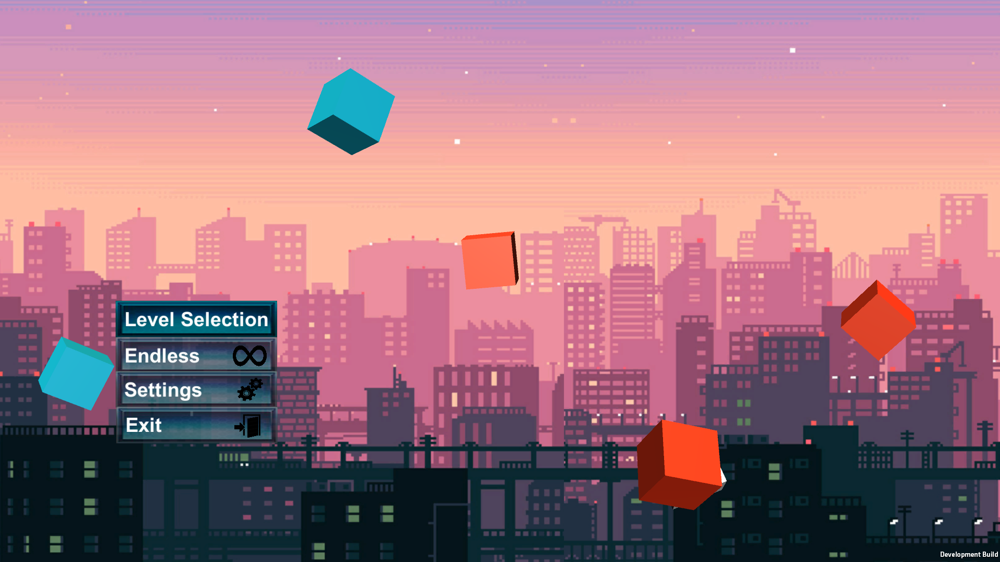
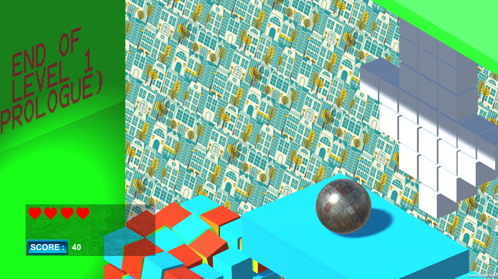

Final Project

## Goo Run

I made a game using the Unity3D framework and C#

The game includes:
- UI/UX
- score based system
- main menu / level selection menu / graphics settings
- a simple key binding layout

The game uses 4 free royalty textures for the ground, the player, and two backgrounds.

The game is made in a 2.5D style and the player is a rolling ball, It can only roll forwards or backwards.
There are three implemented superpowers such as PULL, PUSH and SLAM.
From one of the Brackeys tutorials about grenades, I came with the idea of creating a force field between objects.
- PULL: by pressing E, the ball attracts all objects to itself in a fixed ratio around it. It happens by reversing the grenade explosion system that I learned from Brackeys.
- PUSH: by pressing Q, the ball acts as a grenade itself and pushes all objects away.
- SLAM: by pressing C, the ball gains weight, a lot of weight and slams itself to the ground to break whatever exists in the middle.

## Screenshots

